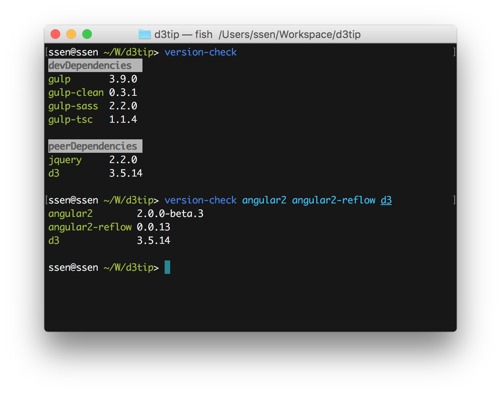

# Usage

```sh
npm install -g version-check

// request specific modules
version-check angular2 rxjs d3 d3tip

// request package.json modules
version-check
```



# [npm-check]

This module is very simple.   
Just check latest versions of your requested modules.
 
If you want more funtionality.    
You can use [npm-check] module.

[npm-check]: https://www.npmjs.com/package/npm-check